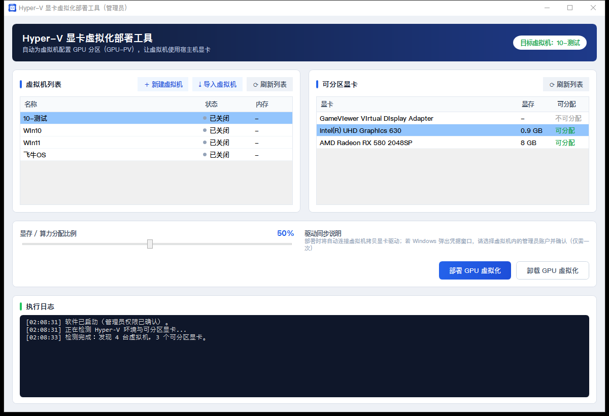
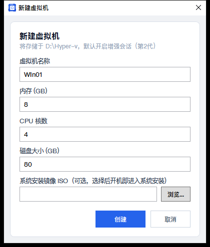

# HyperV GPU-PV 显卡虚拟化工具

给 **Hyper-V 虚拟机共享宿主机显卡** 的图形化一键部署工具：自动完成 GPU 分区（GPU-PV）配置、显卡驱动同步、内存映射（MMIO）设置，任一步骤失败自动回滚，让虚拟机获得接近原生的显卡性能（游戏 / 图形应用 / 渲染）。

[](https://github.com/itxw168/HyperV-GPU-PV/actions/workflows/build.yml)
[](LICENSE)
[]()
[]()
[](../../releases)

---

## ✨ 功能特性

- 🔍 **环境自动检测**：Hyper-V 状态、虚拟机列表、宿主机可分区显卡（型号 / 显存 / 是否可分配）
- ⚡ **一键开启 Hyper-V**：专业版 / 企业版走系统功能；**家庭版自动使用兼容方式安装组件包**
- 🧩 **一键新建虚拟机**：第 2 代、静态内存（GPU 虚拟化要求）、增强会话、可挂载 ISO，统一存储于 `D:\Hyper-v`
- 📥 **一键导入虚拟机**：自动扫描 `D:\Hyper-v`，导入未注册的虚拟机（迁移 / 重装宿主机后快速恢复）
- 🎯 **一键部署 GPU 分区**：按比例（5% ~ 100%）分配显存 / 算力 / 解码 / 编码，自动设置 MMIO，自动把宿主显卡驱动同步进虚拟机，**任一步骤失败自动回滚**
- ♻️ **一键卸载还原**：移除分区、复位 MMIO、按原状态恢复虚拟机
- 📜 **全程实时日志**：每一步执行过程可视化，出错原因直接可读

## 📸 界面预览



<sub>主界面：自动检测虚拟机与可分区显卡 → 拖滑块设置分配比例 → 一键部署 / 卸载，全过程实时日志</sub>



<sub>新建虚拟机：第 2 代 + 静态内存 + 增强会话，统一存储于 D:\Hyper-v，可挂载 ISO 直接装机</sub>

## 🚀 快速开始

1. 到 [Releases](../../releases) 下载 `HyperV-GPU-PV_v1.0.0.zip`（或单独的 `GpuPartitionTool.exe`）
2. 解压后双击 **启动程序.bat**（自动检测 .NET 8 运行时，缺失时引导到官网安装）
3. 程序自动请求管理员权限 → 按界面三步操作：**选虚拟机 → 选显卡并设置分配比例 → 点「部署 GPU 虚拟化」**
4. 部署完成后进入虚拟机，在「设备管理器 → 显示适配器」即可看到宿主机显卡

> 详细步骤见压缩包内《使用说明.txt》。

## 🖥 系统要求

| 项目 | 要求 |
|---|---|
| 操作系统 | Windows 10 / 11（家庭版 / 专业版 / 企业版均可） |
| 运行库 | .NET 8 Desktop Runtime（启动器自动检测并引导安装） |
| 权限 | 管理员（程序自动提权，UAC 确认即可） |
| 显卡 | 支持 GPU 分区（GPU-PV）的显卡：**Intel 核显 / AMD 显卡兼容性最好**；NVIDIA 消费级显卡可能需要特定驱动版本，以实测为准 |
| 其他 | BIOS 开启虚拟化（VT-x / AMD-V）；建议预留 D 盘用于存放虚拟机 |

## 🧠 工作原理（简述）

本工具通过 Hyper-V 官方 PowerShell Cmdlet 完成全流程：

1. `Add-VMGpuPartitionAdapter` 为虚拟机添加 GPU 分区适配器
2. 按比例设置 `Min / Optimal / Max` 的 VRAM / Compute / Decode / Encode 配额（数值对齐 1MB）
3. `Set-VM -GuestControlledCacheTypes $true` 并放宽 MMIO 空间（低 1GB / 高 32GB）
4. 从宿主机解析显卡驱动目录（PnP / 注册表 / DISM 三路兜底），经 **PowerShell Direct**（`New-PSSession -VMName`）拷贝进虚拟机 `C:\Windows\System32\HostDriverStore\FileRepository`
5. 任一步骤失败 → 自动回滚（移除分区 + 复位 MMIO），虚拟机保持安全状态

> 原理参考社区教程 [rainng.com · Hyper-V 显卡虚拟化](https://www.rainng.com/hyperv-vgpu/)；同类开源项目 [Easy-GPU-PV](https://github.com/jamesstringerparsec/Easy-GPU-PV)（纯脚本）也是重要参考。本项目为独立实现的 C# WPF 图形化版本。

## 🛠 从源码构建

```powershell
# 需要 .NET 8 SDK：https://dotnet.microsoft.com/download/dotnet/8.0
powershell -ExecutionPolicy Bypass -File build.ps1

# 产物：
#   publish\GpuPartitionTool.exe            单文件主程序
#   publish\HyperV-GPU-PV_v<版本>.zip       发行压缩包（exe + 启动器 + 使用说明）
```

> 仓库已配置 GitHub Actions（`.github/workflows/build.yml`）：推送 `v*` 标签会自动构建并创建 Release；普通推送 / PR 会上传构建产物供下载。

## 📁 目录结构

```
├── .github\workflows\build.yml   # GitHub Actions：自动构建 + 打 tag 自动发 Release
├── build.ps1                     # 一键构建脚本（生成 exe + 发行 zip）
├── release-assets\               # 发行包附加文件（启动程序.bat / 使用说明.txt）
├── GpuPartitionTool.sln          # Visual Studio 解决方案
├── docs\
│   ├── 设计文档.md               # 实现设计与部署状态机说明
│   └── screenshots\              # README 界面截图
├── src\GpuPartitionTool\
│   ├── App.xaml / MainWindow.xaml（主界面） / CreateVmWindow.xaml（新建虚拟机）
│   ├── Services\                 # PowerShellRunner / HyperVService / DeployService
│   └── Scripts\                  # 核心 PowerShell 脚本（编译时内嵌进 exe）
│       ├── info.ps1              # 检测 Hyper-V / 虚拟机 / 可分区显卡
│       ├── deploy.ps1            # GPU 分区部署（S0~S8，含自动回滚）
│       ├── uninstall.ps1         # 卸载还原
│       ├── create-vm.ps1         # 新建虚拟机
│       ├── import-vm.ps1         # 导入 D:\Hyper-v 中未注册的虚拟机
│       └── enable-hyperv.ps1     # 一键开启 Hyper-V（含家庭版兼容）
└── publish\                      # 构建产物（不入库）
```

## ❓ 常见问题（FAQ）

**Q：检测不到 Hyper-V？**
点界面上的「一键开启 Hyper-V」，完成后重启电脑（家庭版会自动使用兼容方式安装组件包）。

**Q：显卡显示「不可分配」？**
先更新显卡驱动并重启，再刷新重试；仍不可分配说明该显卡 / 驱动组合暂不支持 GPU-PV。

**Q：部署成功但虚拟机里看不到显卡？**
驱动自动同步依赖虚拟机内存在与宿主机同名的管理员账户（PowerShell Direct 免密连接条件）。也可以手动把宿主机显卡驱动目录拷贝到虚拟机 `C:\Windows\System32\HostDriverStore\FileRepository` 后重启虚拟机。

**Q：部署中途失败会不会弄坏虚拟机？**
不会。脚本在任一步失败时自动回滚（移除分区 + 复位 MMIO），虚拟机保持关机状态，可排查后重试。

**Q：卸载后能恢复原样吗？**
可以。「卸载 GPU 虚拟化」会移除分区、复位 MMIO，并按原开关机状态恢复虚拟机。

## ⚠️ 免责声明

本工具会修改 Hyper-V 虚拟机配置（关机 / 开机 / MMIO / 分区适配器）。操作前请为重要虚拟机**创建检查点（快照）**并备份数据。使用本工具即表示你理解并自行承担相关风险。

## 📄 开源协议

[MIT License](LICENSE) © 2026 小魏技术服务

---

## English Overview

**HyperV GPU-PV Tool** — a one-click GUI (C# WPF) that shares your host GPU with Hyper-V virtual machines via **GPU Partitioning (GPU-PV)**: it configures the partition adapter, scales VRAM / compute / decode / encode quotas, sets MMIO, syncs the host GPU driver into the guest over PowerShell Direct, and **auto-rolls back on any failure**.

**Features**: environment detection, one-click Hyper-V enable (incl. Windows Home edition), VM creation & import, GPU-PV deploy / clean uninstall, live logs.

**Requirements**: Windows 10 / 11, administrator rights, .NET 8 Desktop Runtime (the launcher checks it for you), a GPU-PV capable GPU (Intel iGPU / AMD best supported).

**Build**: `powershell -ExecutionPolicy Bypass -File build.ps1` (requires .NET 8 SDK) → `publish\GpuPartitionTool.exe`. Pushing a `v*` tag triggers GitHub Actions to build and publish a Release automatically.

**Credits**: inspired by the community guide at rainng.com and the Easy-GPU-PV project. **License**: MIT © 2026 小魏技术服务 (Xiao Wei Technical Services).